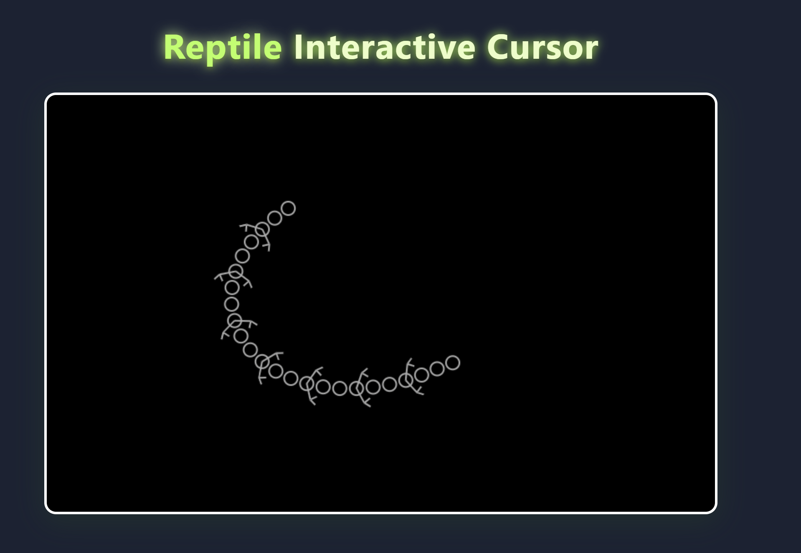

## this is marty sunshine vibecoding
# 🐍 CyberSnake 2025

Welcome to **CyberSnake 2077** — the dangerously smooth, artificially intelligent, totally elastic, and not-at-all-scientifically-accurate browser snake!

I got this idea from one youtube shorts while procrastinating.
 

----------------------------------------------------------------------
further more see .js files advancement from 1-3 (basically tracking the development by saving milestones)
1. aot-eren.js
2. basicsnake.js
3. neonsnake.js
----------------------------------------------------------------------

## What is this?
Ever wanted to be a cyber-snake charmer?  
Do you have a burning need to wiggle a digital reptile around your screen at 60 FPS,  
with *smoother curves than your grandma’s knitting*?

You’re in the right repo.

## How to Play

1. **Open the HTML file in your browser.**
2. **Move your mouse:**  
   The snake’s tongue will hunt your cursor like a caffeine-addicted reptile.  
3. **Click & Hold:**  
   The tongue wiggles (because why not?).
4. **Stare in awe** as the snake bends, twists, and maybe even forms a pretzel.
5. **Brag to your friends** about your superior taste in browser-based animals.

## Features

- **Smooooth Catmull-Rom spline body.**  
  No Minecraft snakes here, only slippery, bendy goodness.
- **Variable segment count:**  
  Go wild. 44 segments? 100 segments? Your CPU is the only limit.
- **Neon and natural color modes:**  
  You can switch snake spot colors with a click (warning: may cause retina excitement).
- **Tongue that follows your mouse and wiggles on command.**  
  Bet you didn’t even know you wanted this.

## Install

No install needed, this is the 21st century.
Just open in Chrome/Firefox/Edge/AnythingButIE.

## FAQ

**Q: Why is the snake so smooth?**  
*A: Because Catmull-Rom splines, baby. Google it.*

**Q: Why is the tongue so obsessed with my cursor?**  
*A: We don’t judge. Let it have its fun.*

**Q: How do I change colors?**  
*A: Click and the snake cycles through neon madness.*

**Q: Why does the snake sometimes look like it’s from Minecraft?**  
*A: You probably broke something. Or maybe not enough segments! Try more!*

## Credits

- 🧑‍💻 Code: Me (and my robot assistant, ChatGPT)
- 🐍 Art Direction: Pure chaos
- 💡 Idea: Too much coffee

## License

MIT, BSD, GPL, BYOB. Just don’t use it to make actual snakes.

---

> **Pro tip:**  
> If you read this far, you’re legally obligated to send a screenshot to the group chat and create a better color palette for the snake.

---

# Stay Slithery!

## Bonus Meme
When you realize your browser snake is smoother than your life decisions: 